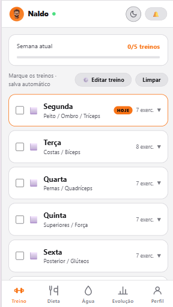

# IronFit — Treino & Dieta

PWA (Progressive Web App) para acompanhamento de treino, dieta e evolução física, com sincronização em nuvem e uso offline.

🔗 **App em produção:** https://elinaldoa.github.io/IronFit/
📣 **Landing page:** https://elinaldoa.github.io/IronFit/landing/



## Funcionalidades

- **Treino semanal** — plano de treino dividido por dia da semana, com séries, repetições, técnica e tempo de descanso por exercício. Marque séries concluídas e registre a carga usada em cada uma.
- **Dieta** — cardápio diário com macros (kcal, proteína, carboidrato, gordura, água).
- **Evolução** — dashboard com:
  - avatar corporal indicando os grupos musculares trabalhados no dia
  - gráfico de volume total por treino
  - heatmap dos últimos 35 dias
  - treinos concluídos por semana
  - evolução de carga por exercício
  - recordes pessoais (PRs)
- **Perfil** — dados corporais (peso, altura), cálculo de IMC, meta principal, estatísticas de frequência e sequência de treinos.
- **Conta e sincronização** — login/cadastro por e-mail, dados salvos na nuvem e sincronizados entre dispositivos.
- **Offline-first** — funciona como PWA instalável, com cache local e atualização automática de versão.
- **Tema claro/escuro** com detecção automática da preferência do sistema.

## Stack

- [React](https://react.dev/) + [Vite](https://vite.dev/)
- Backend como serviço para autenticação e persistência de dados (configurado via variáveis de ambiente, não versionadas)
- `vite-plugin-pwa` para o service worker e manifest do PWA
- Deploy automático no GitHub Pages via GitHub Actions

## Estrutura do repositório

```
.
├── app-react/          # código-fonte do app (React + Vite)
│   ├── public/
│   │   └── landing/      # landing page estática de divulgação (/landing)
│   ├── src/
│   │   ├── components/  # componentes de UI reutilizáveis
│   │   ├── context/      # estado global (auth, tema, toast, treino)
│   │   ├── data/         # dados estáticos do plano de treino/dieta
│   │   ├── lib/           # cliente de dados e utilitários
│   │   └── pages/        # telas do app (Treino, Dieta, Evolução, Perfil)
│   └── vite.config.js
└── .github/workflows/   # pipeline de build e deploy
```

## Rodando localmente

```bash
cd app-react
npm install
```

Crie um arquivo `.env` dentro de `app-react/` (não é versionado) com as credenciais do seu próprio projeto de backend — use `app-react/.env.example` como modelo:

```
VITE_SUPABASE_URL=<url do seu projeto>
VITE_SUPABASE_ANON_KEY=<chave publica/anon do seu projeto>
VITE_VAPID_PUBLIC_KEY=<chave publica VAPID, gerada com `npx web-push generate-vapid-keys`>
```

`VITE_VAPID_PUBLIC_KEY` é usada para inscrever o navegador em notificações push (funcionam com o app fechado). Sem ela, o app funciona normalmente, só a inscrição de push falha com "Push não configurado". A chave privada correspondente fica só no backend, como secret `VAPID_PRIVATE_KEY` das Edge Functions `send-reminders` e `send-push` (nunca no frontend).

Duas Edge Functions cuidam de push (implantação manual, dashboard → Edge Functions → New function, colar o código de `supabase/functions/<nome>/index.ts`):
- `send-reminders` — chamada só pelo cron (`pg_cron`, a cada minuto); **Verify JWT desativado**, pois não há usuário logado numa chamada interna do cron. Cobre refeição/água (horário fixo) e as notificações inteligentes: sequência em risco, inatividade, resumo semanal e lembrete de atualizar o peso (segunda de manhã).
- `send-push` — chamada pelo próprio app logo após um evento (novo recorde, conquista desbloqueada); **Verify JWT ativado**, já que o usuário só pode mandar push pra si mesmo (o `user_id` vem do token da sessão, nunca do corpo da requisição).

Depois:

```bash
npm run dev      # ambiente de desenvolvimento
npm run build    # build de produção em app-react/dist
```

## Deploy

O deploy é automático: qualquer push em `main` que altere arquivos dentro de `app-react/` dispara o workflow `.github/workflows/deploy.yml`, que builda o projeto e publica no GitHub Pages.

Migrations do Supabase (`supabase/migrations/`) não são aplicadas em produção automaticamente — rode `supabase db push` localmente (com o CLI já linkado ao projeto) sempre que adicionar uma migration nova.

## Antes de abrir pra outras pessoas

O app já suporta múltiplas contas (cadastro por e-mail, RLS isolando os dados de cada
usuário) e tem Termos de Uso + Política de Privacidade em `app-react/public/legal/`
(com checkbox obrigatório no cadastro). Antes de divulgar amplamente, faltam alguns
passos manuais:

- **Revisão jurídica dos textos legais**: `legal/termos.html` e `legal/privacidade.html`
  são rascunho, com placeholders (`[nome/razão social]`, `[e-mail de contato]`, etc.) —
  preencher e pedir revisão antes de tratar como documento válido.
- **Leaked password protection**: ativar em Authentication → Policies no dashboard do
  Supabase (não dá pra fazer via CLI sem risco de sobrescrever outras configs de Auth).
- **E-mail transacional**: o SMTP embutido do Supabase tem limite baixo de e-mails/hora.
  Se confirmação de cadastro ou reset de senha começarem a falhar silenciosamente com
  mais gente se cadastrando, configurar um provedor próprio (Resend, SES, etc.) em
  Authentication → Email Templates → SMTP.
- **Custo/escala**: checar os limites do plano atual do Supabase (linhas de banco,
  storage de fotos, invocações de Edge Function) antes de divulgar amplamente.
